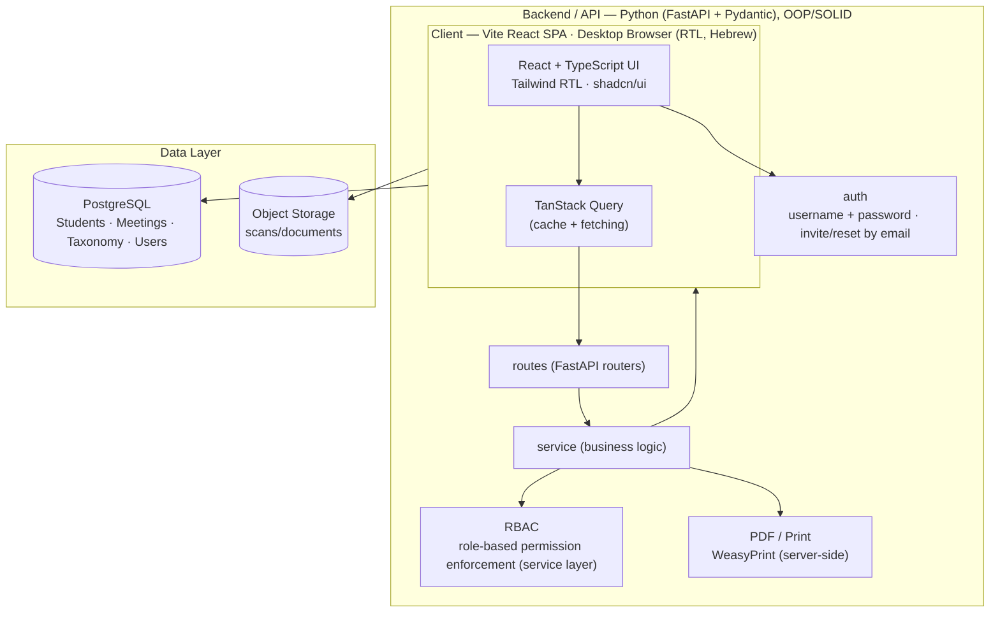
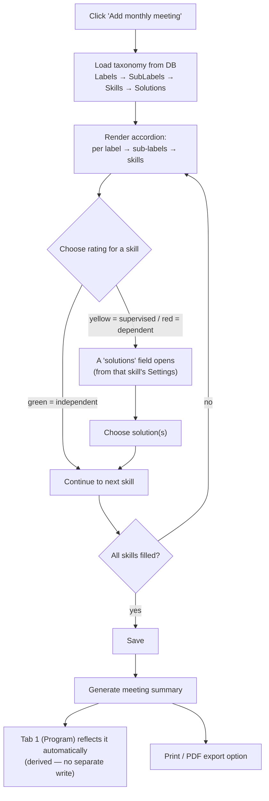
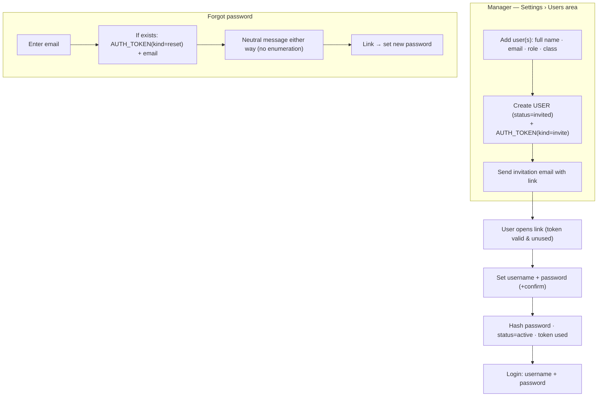
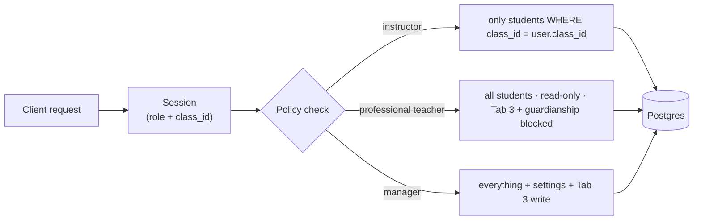
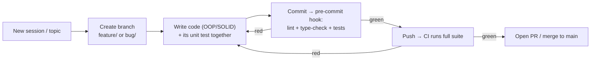

# ARCHITECTURE — Cloud Student Care System ("Aleisiach")

This document describes the technical architecture: layers, folder structure, data model,
key flows, and permission enforcement. It is derived from the brief in Claude Design
(`Student Care System.dc.html`) and from `CLAUDE.md`. Decision rationale lives in `DECISIONS.md`.

> Stack per `CLAUDE.md` (LOCKED): **Vite React SPA** frontend + **Python (FastAPI + Pydantic)
> backend** in OOP/SOLID, PostgreSQL. Two separate apps talking over HTTP. If the stack changes —
> update this document accordingly.

---

## 1. Overview — system layers



**Key principle:** permissions are enforced **at the server layer** (RBAC in the service layer),
not only in the UI. The UI hides/shows content per role for UX; the server is the source of
truth for security. Dependencies flow one way: `routes → service → client → models` (SOLID —
routes never touch the DB directly).

---

## 2. Folder structure

### Backend — Python, layered (mandatory)
Top level = the layers. The three primary layers (`routes`, `service`, `client`) hold the
executable code. Each of the **remaining** layers (`schema`, `models`, `configuration`, `errors`,
`utils`) is split **internally by the consuming layer** — `routes / service / client` — so every
supporting artifact sits next to the layer that uses it.

```
backend/
├─ app/
│  ├─ routes/                  # FastAPI routers (HTTP only, no business logic)
│  ├─ service/                 # business logic (SOLID, injected dependencies)
│  ├─ client/                  # repositories / DB & external access (SQLAlchemy)
│  ├─ schema/                  # Pydantic v2 DTOs, grouped by consuming layer
│  │  ├─ routes/               #   request/response models (the HTTP contract)
│  │  ├─ service/              #   inter-service / domain DTOs
│  │  └─ client/               #   data-access DTOs
│  ├─ models/                  # SQLAlchemy ORM classes
│  │  ├─ routes/  service/  client/
│  ├─ configuration/           # all configurable settings, in folders by area
│  │  ├─ database/  auth/  pdf/  app/   # pydantic-settings per area + DI wiring
│  ├─ errors/                  # typed exceptions + handlers
│  │  ├─ routes/               #   HTTP error mapping
│  │  ├─ service/              #   business-rule errors
│  │  └─ client/               #   DB / external errors
│  └─ utils/                   # shared helpers (pdf, dates, validation)
│     ├─ routes/  service/  client/
├─ tests/                      # unit tests mirroring the structure (one per component)
├─ migrations/                 # Alembic
└─ pyproject.toml
```
> Dependency direction of the primary layers: `routes → service → client → models`. A layer
> imports only downward. The supporting layers (`schema`, `models`, `configuration`, `errors`,
> `utils`) are each partitioned by which primary layer consumes them.

### Frontend — Vite React SPA
```
frontend/
├─ index.html
├─ vite.config.ts
└─ src/
   ├─ main.tsx                 # app entry
   ├─ App.tsx                  # router (react-router) + providers
   ├─ pages/
   │  ├─ login/                # login screen (design variations)
   │  ├─ students/[id]/        # student screen with tabs
   │  │  ├─ program/  meetings/  social-note/  details/   # Tabs 1–4
   │  └─ settings/             # Settings page (manager only)
   ├─ components/              # shared UI components (RTL) + app shell/header
   ├─ features/                # auth/ students/ meetings/ taxonomy/ notes/
   ├─ lib/                     # api client, validation (zod), query setup
   └─ styles/                  # Aleisiach theme (colors/font)
```

---

## 3. Data Model

```mermaid
erDiagram
    USER ||--o{ CLASS : "instructor owns"
    USER ||--o{ AUTH_TOKEN : "invite/reset tokens"
    CLASS ||--o{ STUDENT : "assigned to"
    STUDENT ||--|| STUDENT_DETAILS : "details"
    STUDENT ||--o{ STUDENT_EXTRA_SECTION : "extra sections (Tab 4, headings 5+)"
    EXTRA_SECTION_TYPE ||--o{ STUDENT_EXTRA_SECTION : "heading"
    STUDENT ||--o{ TEAM_MEETING : "meetings (Tab 2)"
    STUDENT ||--|| SOCIAL_NOTE : "social note (Tab 3)"
    TEAM_MEETING ||--o{ MEETING_ENTRY : "entries"
    MEETING_ENTRY }o--|| SKILL : "assessed skill (ref)"
    MEETING_ENTRY ||--o{ MEETING_ENTRY_SOLUTION : "chosen solutions"
    MEETING_ENTRY_SOLUTION }o--|| SOLUTION : "ref"
    LABEL ||--o{ SUBLABEL : ""
    SUBLABEL ||--o{ SKILL : ""
    SKILL ||--o{ SOLUTION : "possible solutions"

    USER {
        uuid id
        string full_name
        string email "unique — for invite/reset"
        string username "unique — chosen at invite acceptance"
        string password_hash "argon2/bcrypt; null until invite accepted"
        enum role "manager|instructor|professional_teacher"
        uuid class_id "instructor only"
        enum status "invited|active|disabled"
    }
    AUTH_TOKEN {
        uuid id
        uuid user_id
        enum kind "invite|password_reset"
        string token_hash "store hash, never the raw token"
        timestamp expires_at
        timestamp used_at "nullable — single use"
    }
    STUDENT {
        uuid id
        uuid class_id
        string full_name
        bool is_archived "soft-delete; hidden from lists"
        timestamp archived_at "nullable"
        uuid archived_by "nullable — manager id"
    }
    AUDIT_LOG {
        uuid id
        uuid actor_id "who made the change"
        enum action "create|update|archive"
        string entity_type "student|student_details|meeting|taxonomy|permission"
        uuid entity_id
        jsonb changes "field-level diff (no raw sensitive values in logs)"
        timestamp created_at
    }
    STUDENT_DETAILS {
        string national_id
        date dob
        int age
        string address
        string home_language
        enum legal_status "guardian_appointed|parents_are_guardians"
        jsonb contacts "guardian A/B + emergency"
        jsonb medical_diagnoses
    }
    EXTRA_SECTION_TYPE {
        uuid id
        string name "heading text (managed in Settings)"
        int order
    }
    STUDENT_EXTRA_SECTION {
        uuid id
        uuid student_id
        uuid section_type_id
        text content
    }
    TEAM_MEETING {
        uuid id
        uuid student_id
        int year
        int month
        uuid author_id
        timestamp created_at
    }
    MEETING_ENTRY {
        uuid id
        uuid meeting_id
        uuid skill_id "ref (may be deactivated later)"
        string skill_name_snapshot "text at save time"
        enum rating "green=independent|yellow=supervised|red=dependent"
    }
    MEETING_ENTRY_SOLUTION {
        uuid id
        uuid meeting_entry_id
        uuid solution_id "ref"
        string solution_text_snapshot "text at save time"
    }
    LABEL { uuid id; string name; int order; bool is_active }
    SUBLABEL { uuid id; uuid label_id; string name; int order; bool is_active }
    SKILL { uuid id; uuid sublabel_id; string name; int order; bool is_active }
    SOLUTION { uuid id; uuid skill_id; string text; bool is_active }
```

### Model notes
- **Tab 1 (Program) is NOT stored** — it is a **derived read-model**: the **latest rating per
  skill across all** the student's team meetings (decided). For each skill ever assessed, the most
  recent meeting that rated it decides its bucket — green → strengths (מוקדי כח); yellow/red →
  areas to strengthen (מוקדים לחיזוק) with that entry's chosen solutions as the "path to solution".
  No `PROGRAM` table, no manual editing.
- **The taxonomy (Label → SubLabel → Skill → Solution)** is the dynamic core. It is managed on
  the Settings page and feeds the Tab 2 form. Do not hard-code it.
- **`MEETING_ENTRY.rating`**: green=independent, yellow=supervised, red=dependent. On yellow/red
  a solution must be chosen → `MEETING_ENTRY_SOLUTION`.
- **Taxonomy history (decided): snapshot + soft-delete.** On save, each entry copies the skill and
  chosen-solution **text** into `*_snapshot` columns, so historical meeting summaries stay faithful
  even if the taxonomy later changes. Taxonomy rows are **never hard-deleted** — Settings toggles
  `is_active=false` (deactivated rows disappear from the Tab 2 form but keep their FKs valid).
- **Tab 4 extra sections (headings 5+) — normalized tables** (decided): `EXTRA_SECTION_TYPE`
  holds the heading text (configurable in Settings, so exact wording is data, not schema), and
  `STUDENT_EXTRA_SECTION` holds each student's content per heading. Exact heading names still to
  be provided by the user, but they enter as rows — no schema change needed.
- **`contacts` / `medical_diagnoses`** kept as JSONB for now; revisit to tables if strong querying
  or per-field validation is needed.
- **`age`** — prefer computing from `dob` rather than storing it (avoids inconsistency).

---

## 4. Key flow — Team-meeting form (Tab 2)

This is the most complex flow. A single long accordion page composed dynamically from the taxonomy.



**Implementation rules:**
- Validation: cannot save while any skill rated yellow/red has no chosen solution.
- **Tab 1 derivation (decided):** green → strengths; yellow/red → areas to strengthen, with the
  entry's chosen solutions as the "path to solution". Computed as the latest rating **per skill
  across all** the student's meetings (newest-first, first rating seen per skill wins).
- Save must be atomic (transaction): meeting + all entries + solution links.

---

## 4b. Auth flows (password-based)



- Passwords hashed (argon2/bcrypt). Tokens: random, stored **hashed**, single-use, time-expiring.
- Rate-limit + lockout on login and forgot-password. National ID is **not** an auth factor.
- Self-service password change lives in the user's personal settings.
- Requires an **email-sending service** (provider TBD) — configured under `configuration/`.

---

## 5. Permission enforcement (RBAC / RLS)



- **Enforcement point:** the **service layer** in Python. A FastAPI dependency resolves the
  current user (role + `class_id`) and injects it; each service applies the role's filter before
  the client/repository queries the DB (e.g. instructor → `class_id = user.class_id`).
- Implement as an authorization policy object (Strategy per role) injected into services — SOLID,
  and easy to unit-test in isolation.
- **The UI** hides tabs/fields by role — but this is a convenience layer only, not security.
- **Three roles only** (`manager`, `instructor`, `professional_teacher`); no social-worker role —
  Tab 3 is written by managers. Professional teacher is read-only everywhere, blocked from Tab 3
  and the guardianship/legal-status fields (see `CLAUDE.md` §3 matrix).

---

## 6. Security & privacy (cross-cutting)

- Sensitive data (minors, diagnoses, guardianship): encryption at rest and in transit (TLS),
  least privilege.
- **Never log** national IDs/diagnoses/contact details. Filter logs.
- **Auth = username + password (decided):** national ID is not an auth factor. Manager-provisioned
  via email invitation; hashed passwords; single-use expiring invite/reset tokens (stored hashed);
  rate-limit + lockout on login and forgot-password; forgot-password returns a neutral message to
  avoid email enumeration. See §3 (`CLAUDE.md`) and the §4b flow.
- **Deletion = archive only (decided):** students are never hard-deleted from the UI — a manager
  sets `is_archived=true` (soft-delete), which hides them from lists while keeping the data. Hard
  deletion happens only manually in the DB by a system admin.
- **Audit log = changes only (decided):** every create/update/archive of a student, student
  details, meeting, taxonomy, or permission is recorded in `AUDIT_LOG` (actor + what changed +
  when). Reads/views are **not** logged. Never store raw sensitive values in the diff — log field
  names and change markers, not national IDs/diagnoses.
- **Retention:** archived students are kept for a configurable period (a `configuration/` value,
  exact number TBD) before purge/anonymization.

---

## 7. Development workflow (git & testing)



- **Branch per session/topic:** every session starts on a fresh branch named for its topic
  (`feature/<topic>`, `bug/<topic>` / `fix/<topic>`). No direct commits to `main`.
- **Test-with-code:** each new component (route/service/client/util) is created together with its
  unit test. Tests mirror the layer/domain structure under `tests/`.
- **Green-before-upload:** a pre-commit/pre-push git hook runs lint + `mypy` + the test suite;
  CI re-runs the full suite on every push. A red suite blocks the merge.

---

## 8. Open dependencies (synced with CLAUDE.md §6)
- Exact heading names for Tab 4 sections 5+ (structure decided = tables; names to be supplied).
- Hebrew font choice for UI + PDF (deferred; Tubic vs Heebo — see `branding`).
- Email-sending provider for invitations/resets (TBD, configured under `configuration/`).
- Login/student-screen design variation choice.

_Resolved: professional-teacher access (read-only; Tab 3 + guardianship blocked); three roles
only, managers write Tab 3; Tab 1 is a derived read-model (latest rating per skill across meetings); Tab 4 extra
sections = normalized tables; taxonomy history = snapshot + soft-delete; students archive-only
(manager); audit log records changes only; stack locked (Vite SPA + FastAPI); auth =
username/password with email invite + reset._

---

_Sources: the brief in Claude Design (`Student Care System.dc.html`), `CLAUDE.md`._
